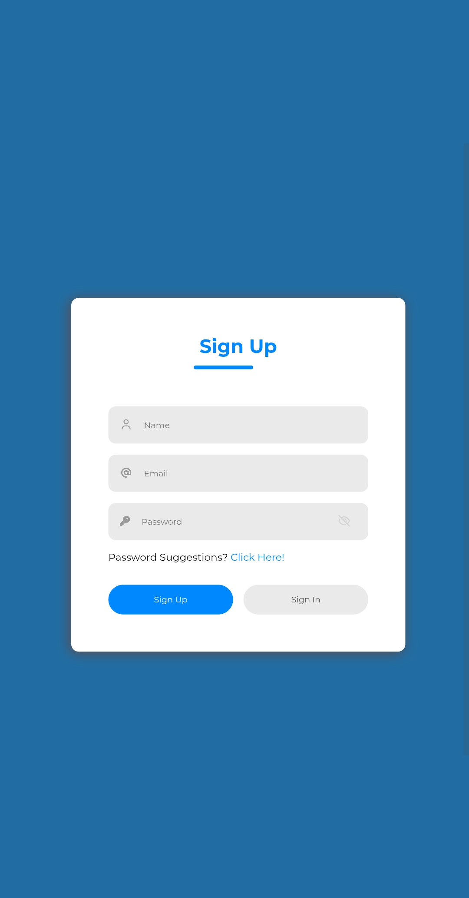

# Sign In / Sign Up Form Switcher

A clean, modern, and fully responsive **Sign In / Sign Up form toggle** built with pure HTML, CSS, and vanilla JavaScript. Features smooth animations, a password visibility toggle, and an elegant sliding underline indicator.

  

## Features

- Toggle between **Sign In** and **Sign Up** modes with a single click
- Animated sliding underline that follows the active button
- Name field smoothly appears/disappears when switching to Sign Up
- Password visibility toggle (eye icon)
- Fully responsive design
- No external dependencies – only HTML, CSS, and vanilla JavaScript
- Easy to customize colors, fonts, and layout
