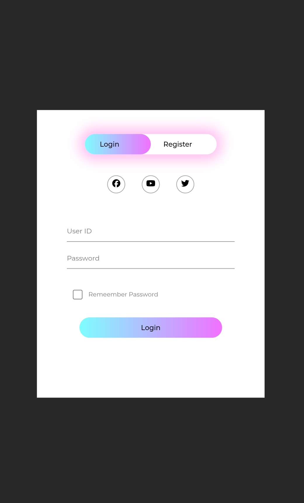

# Animated Login & Signup Form

An interactive authentication form with smooth animations and toggle functionality.

## Features

- Smooth transition between Sign In and Sign Up modes
- Password visibility toggle (show/hide)
- Animated underline indicator
- Responsive name field that appears/disappears
- Clean and modern UI design

## How It Works

- Click **Sign In** to switch to login mode
- Click **Sign Up** to switch to registration mode
- Use the eye icon to show/hide password
- Dynamic title and text changes based on active mode

## Preview

## Technologies Used

- HTML5
- CSS3 (with animations)
- JavaScript (Vanilla)
- Font Awesome Icons

## Usage

Simply open the HTML file in your browser to see the animated form in action. Switch between Sign In and Sign Up modes to experience the smooth transitions.

## License

This project is open source and available for everyone.